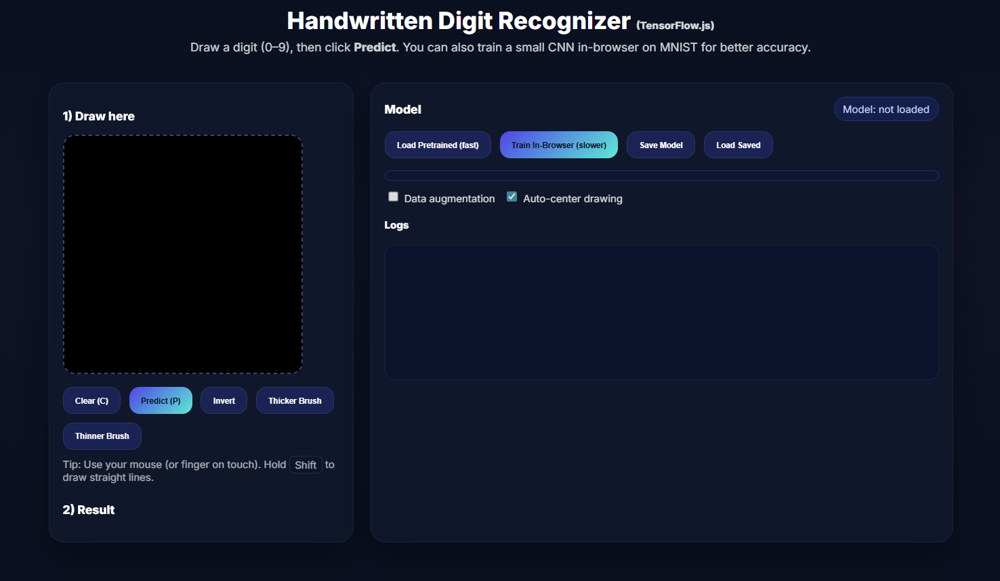

# Handwritten Digit Recognizer ✍️🔢

This is a browser-based **Handwritten Digit Recognizer** built with **TensorFlow.js**.  
You can draw digits (0–9) on the canvas, and the AI model will predict them in real-time 🚀

## 🚀 Features
- Draw digits directly in the browser 🖌️  
- Predicts handwritten numbers (0–9) instantly 🔢  
- Option to train the model in-browser or use a pre-trained model 🤖  
- Save & load trained models for later use 💾  
- Built entirely with **JavaScript + TensorFlow.js** (no backend needed)  

## 🛠️ Tech Stack
- **TensorFlow.js** – Machine learning in the browser  
- **JavaScript (ES6)**  
- **HTML5 Canvas** – Drawing area for digits  

## 📸 Demo
1. Open the app in your browser  
2. Draw any digit (0–9) on the canvas  
3. Click **Predict** → The AI will show its best guess  
## 🛣️Preview

## 📂 Project Structure
```
📁 digit-recognizer
 ┣ 📜 index.html      # Main app (canvas + controls)
 ┣ 📜 script.js       # Model logic (training & prediction)
 ┣ 📜 style.css       # Basic styling (optional)
 ┗ 📜 README.md       # Project documentation
```

## 🔧 Installation & Usage
1. Clone this repo:  
   ```bash
   git clone https://github.com/your-username/digit-recognizer.git
   cd digit-recognizer
   ```
2. Open `index.html` in your browser  
3. Start drawing & predicting digits 🎉  

## 🌟 Future Improvements
- Deploy on GitHub Pages / Vercel for public access  
- Add better UI/UX with React + Tailwind  
- Support more advanced handwriting datasets  

## 📷 Connect with me
- Instagram: [@prikshit.957](https://instagram.com/prikshit.957)  
- LinkedIn: [Your LinkedIn Profile]  
